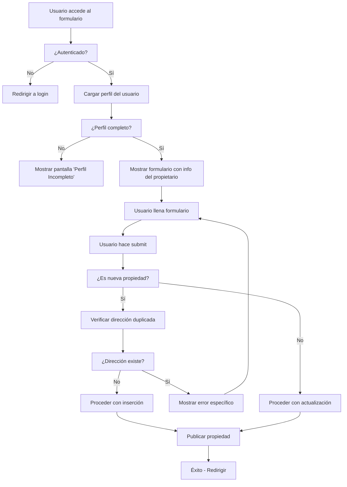

# 🔧 PropertyPublicationForm - Mejoras Implementadas

## 🚨 Problemas Resueltos

### **1. Error 409 Conflict**
**Problema:** El formulario intentaba publicar propiedades en direcciones que ya existían, causando errores 409 Conflict.

**Solución:** Implementación de verificación previa de dirección duplicada antes del envío.

### **2. Falta de Claridad sobre Propietario**
**Problema:** Los usuarios no sabían claramente quién estaba realizando la publicación.

**Solución:** Sección dedicada que muestra la información del propietario actual de forma clara y prominente.

### **3. Perfiles Incompletos**
**Problema:** Usuarios con perfiles incompletos podían intentar publicar propiedades.

**Solución:** Validación de perfil completo antes de permitir el acceso al formulario.

## ✅ Funcionalidades Implementadas

### **1. Sección "Información del Propietario Actual" (Solo Lectura)**

```typescript
// Muestra información clara del propietario que está publicando
<div className="bg-blue-50 border border-blue-200 p-6 rounded-lg">
  <h3>Información del Propietario Actual</h3>
  // Nombre completo, RUT, email, teléfono
</div>
```

**Características:**
- ✅ Información del perfil del usuario autenticado
- ✅ Diseño visual atractivo con iconos
- ✅ Campos: Nombre completo, RUT, Email, Teléfono
- ✅ Enlaces a "Mi Perfil" para actualizaciones
- ✅ Manejo de campos vacíos ("No especificado")

### **2. Validación de Perfil Completo**

```typescript
// Verifica que el perfil tenga nombre y RUT antes de permitir publicación
const checkProfileComplete = (profile: any) => {
  return profile &&
         profile.first_name &&
         profile.paternal_last_name &&
         profile.rut;
};
```

**Comportamiento:**
- ✅ Si perfil incompleto → Muestra pantalla de advertencia
- ✅ Deshabilita completamente el formulario
- ✅ Botón directo a "Completar Mi Perfil"
- ✅ Mensaje claro sobre por qué es necesario

### **3. Verificación de Dirección Duplicada**

```typescript
// Verifica si ya existe una propiedad en la dirección especificada
const checkAddressExists = async (street: string, number: string, department: string | null) => {
  const { data, error } = await supabase
    .from('properties')
    .select('id')
    .eq('address_street', street)
    .eq('address_number', number)
    // Manejo inteligente de department (null o vacío)
};
```

**Lógica:**
- ✅ Solo verifica para nuevas propiedades (no para ediciones)
- ✅ Maneja casos donde department es null o vacío
- ✅ Comparación exacta de calle, número y departamento
- ✅ Mensaje de error específico y claro

### **4. Sección de Actualización Opcional**

```typescript
// Campos opcionales para actualizar información mientras se publica
<div className="bg-gray-50 p-6 rounded-lg">
  <h3>Actualizar Información del Propietario (Opcional)</h3>
  // Todos los campos ahora son opcionales con placeholders
</div>
```

**Mejoras:**
- ✅ Campos opcionales con placeholders informativos
- ✅ Texto explicativo sobre la funcionalidad
- ✅ No interrumpe el flujo de publicación

## 🔍 Estados del Formulario

### **1. Cargando Perfil**
```
🔄 "Cargando tu perfil..."
```
- Muestra spinner mientras carga el perfil del usuario

### **2. Perfil Incompleto**
```
⚠️ "Perfil Incompleto"
Para publicar una propiedad, primero debes completar tu perfil...
[Completar Mi Perfil]
```
- Pantalla completa de advertencia
- Botón directo a perfil
- Formulario completamente deshabilitado

### **3. Perfil Completo - Información Visible**
```
👤 Información del Propietario Actual
┌─────────────────────────────────────┐
│ Nombre: Juan Pérez González         │
│ RUT: 12.345.678-9                   │
│ Email: juan@email.com              │
│ Teléfono: +56 9 1234 5678          │
└─────────────────────────────────────┘
```

### **4. Dirección Duplicada**
```
❌ "Ya existe una propiedad publicada en esta dirección.
Por favor, verifica la dirección o contacta al propietario si es tu propiedad."
```
- Mensaje específico y útil
- Sugerencias de acción para el usuario

## 📋 Flujo de Validaciones



## 🎯 Beneficios Obtenidos

### **Para el Usuario**
- ✅ **Claridad total** sobre quién publica la propiedad
- ✅ **Prevención de errores** de dirección duplicada
- ✅ **Guía clara** cuando el perfil está incompleto
- ✅ **Experiencia fluida** con actualizaciones opcionales

### **Para el Sistema**
- ✅ **Prevención de datos duplicados** en direcciones
- ✅ **Validación robusta** de perfiles completos
- ✅ **Mensajes de error específicos** y útiles
- ✅ **Mantenimiento de integridad** de datos

### **Para el Administrador**
- ✅ **Logs claros** de validaciones realizadas
- ✅ **Trazabilidad** de errores y conflictos
- ✅ **Prevención proactiva** de problemas de datos

## 🔧 Código Principal

### **Estado y Validaciones**
```typescript
const [ownerProfile, setOwnerProfile] = useState<any>(null);
const [profileLoading, setProfileLoading] = useState(true);
const [profileComplete, setProfileComplete] = useState(false);

// Función de validación de perfil
const checkProfileComplete = (profile: any) => {
  return profile && profile.first_name && profile.paternal_last_name && profile.rut;
};

// Función de verificación de dirección
const checkAddressExists = async (street: string, number: string, department: string | null) => {
  // Lógica de verificación con Supabase
};
```

### **Renderizado Condicional**
```typescript
// Pantalla de carga del perfil
if (profileLoading) return <LoadingScreen />;

// Pantalla de perfil incompleto
if (!profileComplete) return <IncompleteProfileWarning />;

// Formulario principal con información del propietario
return (
  <div>
    <OwnerInfoSection profile={ownerProfile} />
    <PropertyForm />
    <OptionalOwnerUpdateSection />
  </div>
);
```

## 📝 Próximos Pasos

1. **Aplicar la migración RLS** para solucionar errores 403/406 en la base de datos
2. **Testing exhaustivo** con diferentes escenarios:
   - Usuario con perfil completo
   - Usuario con perfil incompleto
   - Intento de dirección duplicada
   - Actualización de información del propietario
3. **Monitoreo de logs** para verificar funcionamiento en producción
4. **Feedback de usuarios** para posibles mejoras adicionales

---

**Estado**: ✅ **Implementado completamente**
**Funcionalidades**: ✅ **Todas las requeridas implementadas**
**Testing**: 🔄 **Listo para pruebas**
